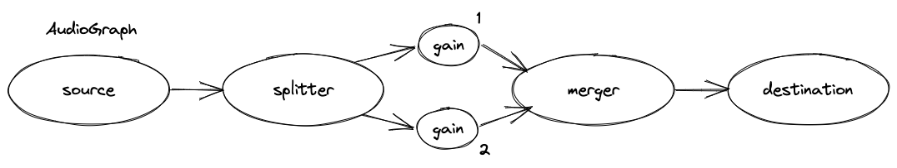
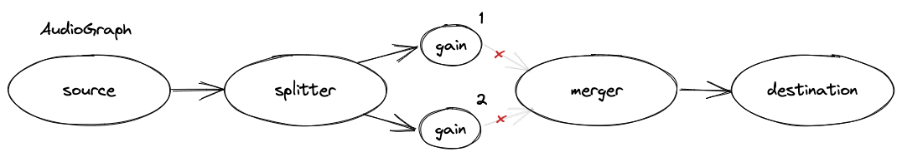
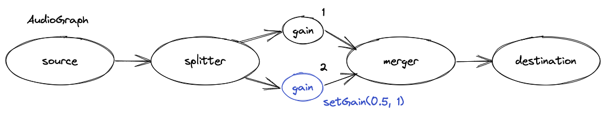

## audio-context-router
Easy & simple multi-channel audio manipulation with Web Audio

### Features
- Easy playback of remote and local `MediaStream` objects
- Designed to allow for multiple tracks per user-group
- Simple channel-specific gain controls
- Supports easy insertion of additonal `AudioNode` objects.

### Getting Started
> Note: This hasn't been published yet

```js
import Audio from 'audio-context-router';
```

#### Setting the configuration:
```js
Audio.setConfiguration({
  input: {
    channels: 2
  },
  output: {
    channels: 2
  }
});
```
Note: In most cases this doesn't need to be called because Chromium only supports stereo (2-channel) inputs and outputs, however hacks can be used to introduce multi-channel support ([Learn more](https://support.google.com/chrome/thread/21248703/5-1-surround-sound-in-chrome?hl=en)).

#### Starting audio playback (connecting the graph):

```js
const audio = Audio.addInstance('james', 'guitar');
const stream = new MediaStream();

// Set stream via any source
audio.setStream(stream);

// Playback audio
audio.play();
```
Note: If a remote stream is being supplied (eg. via WebRTC), you'll likely need to use the `useAudioElement` option when calling `addInstance`. This is because Chromium has issues with remote streams and the Web Audio API ([Learn More](https://bugs.chromium.org/p/chromium/issues/detail?id=121673)).



#### Stopping audio playback:
```js
const audio = Audio.getInstance('james', 'guitar');

// Disconnect gains from merger to stop audio
audio.stop();
```



#### Disconnecting audio graph instance:

```js
const audio = Audio.getInstance('james', 'guitar');

// Disconnect and clear audio graph instance
audio.disconnect();
```


#### Modifying audio gain (volume):
```js
const audio = Audio.getInstance('james', 'guitar');

// Set gain of all channels to 50%
audio.setGain(0.5);

// Set gain of right channel
audio.setGain(0.5, 2);
```



#### Muting audio by channel:

```js
const audio = Audio.getInstance('james', 'guitar');

// Mute R channel
audio.mute(2);

// Later... Unmute R channel
audio.unmute(2);
```


#### Getting an `AudioNode`:

```js
const graph = Audio.getInstance('james', 'guitar');

const audioNode = graph.getNode('splitter');
```
Note: By default, all graphs contain `source`, `splitter`, `merger`, `[gain]` however this method can also be used to retrieve custom nodes.


#### Adding custom `AudioNode` into the graph:
```js
const graph = Audio.getInstance('james', 'guitar');
const context = Audio.getContext();

const source = graph.getNode('source');
const analyser = context.createAnalyser();

// ... draw stuff using analyser data

source.connect(analyser);
```


#### Isolate single channel from `MediaStream` object:
```js
const stereoStream = new MediaStream();
const monoStream = Audio.getChannelStream(stereoStream, 2);

// ... Do something with new mono stream
```

### Documentation

#### API

```js
// AudioRouter
setConfiguration(config)
addInstance(groupId, trackId, useAudioElement): AudioGraph
getInstanceGroup(groupId): [AudioGraph]
getInstance(groupId, trackId): AudioGraph
getContext(): AudioContext
getChannelStream(stream, channel): MediaStream

// AudioGraph
getInputChannels(): [number]
getOutputChannels(): [number]
getNode(key, channel): AudioNode
setNode(key, node, channel): AudioNode
setStream(stream)
setGain(value, channel)
play(channel)
stop(channel)
mute(channel)
unmute(channel)
disconnect()
```

### License

audio-context-router (c) by Jaden Dessureault

audio-context-router is licensed under a Creative Commons Attribution-ShareAlike 4.0 International License.

